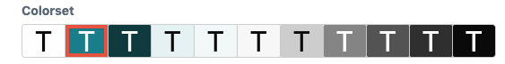
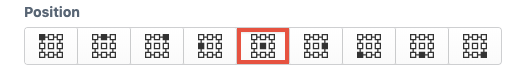
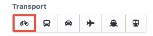

# Examples

## Colorset



This example shows the usage of CSS classes and labels to let the user switch between preconfigured back- and foreground colors. So the user can see, how the color will look like.

To run this example, copy the [```colorset/buttons.php```](colorset/buttons.php) to your Craft config folder and the [```colorset/colorset.css```](colorset/colorset.css) to a subfolder called ```buttons```.

## Positions



This example uses images as buttons to switch between different positions. 

To run this example, copy the [```positions/buttons.php```](positions/buttons.php) to your Craft config folder and the folder [```positions/images```](positions/images) to a subfolder called ```buttons```.

## Transport



In this example we use the Font Awesome Icons with our radio buttons. We add the Font Awesome CSS URL and the corresponding CSS classes to the buttons.

To run this example, just copy the [```transport/buttons.php```](transport/buttons.php) to your Craft config folder.


